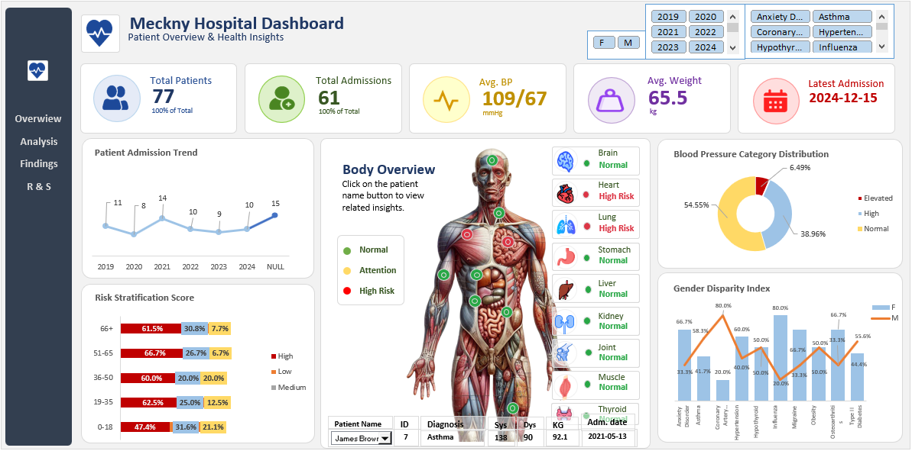
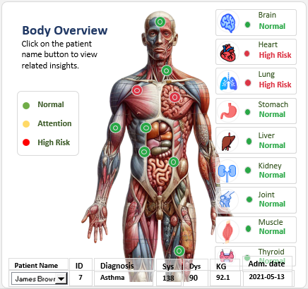

# Meckny Patient Analytics

Meckny patient analytics is an end-to-end analytics project that transforms raw, messy patient records into an interactive clinical dashboard.
Data was cleaned and enriched using SQL, then visualized in Excel with KPI cards, trend charts, and risk stratification breakdowns. A custom VBA-driven panel let's users navigate individual patient records, dynamically updating vitals, diagnosis and an anatomical organ-status visualization for each selected patient.



## Project Overview

This project takes a raw, messy patient records export and turns it into a decision-ready clinical dashboard. The workflow spans the full analytics pipeline: data cleaning in SQL, schema enrichment, and dashboard/interactivity design in Excel with VBA.

The dashboard is built for a hospital operations/clinical audience and answers three core questions:
1. How is patient volume trending over time?
2. What does the patient population's cardiovascular and risk profile look like?
3. Can a specific patient be pulled up quickly to review their vitals, diagnosis, and affected organ system?

## Tools Used

| Stage | Tool |
|---|---|
| Data cleaning & transformation | SQL (MySQL) |
| Dashboard & visualization | Microsoft Excel (PivotTables, charts) |
| Interactivity | VBA (Visual Basic for Applications) |

## Data Pipeline

1. **Raw data** (`data/raw_messy_data.csv`) — original export containing inconsistent formatting, blank/duplicate fields, and unstandardized categorical values.
2. **Cleaning** (`sql/cleaning_queries.sql`) — SQL queries used to deduplicate records, standardize categorical fields (gender, diagnosis, BP category), and engineer derived columns.
3. **Cleaned dataset** (`data/cleaned_data.csv`) — final 18-column table imported into Excel:

   `Patient ID, Full Name, Gender, Male Count, Female Count, Age, Age Group, Diagnosis, Blood Pressure, BP Category, Systolic, Diastolic, Risk Tier, Weight (kg), Weight, Admission Date, Month-Year, Admission Year`

   > **Note:** Patient names in this repository have been anonymized. No real patient-identifiable data is published here.

## Dashboard Components

### KPI Summary
- Total Patients: 77
- Total Admissions: 61
- Avg. Blood Pressure: 109/67
- Avg. Weight: 65.5 kg
- Latest Admission: 2024-12-15

### Charts
1. **Patient Admission Trend (2019–2024)** — yearly admission volume
2. **Blood Pressure Category Distribution** — Normal / Elevated / High, as a % of patients
3. **Risk Stratification Score by Age Group** — Low / Medium / High risk share within each age bracket
4. **Gender Disparity Index** — male/female split across 10 diagnosis categories

### Interactive Patient Panel
A VBA-driven panel lets a user step through patients via a navigation button. Selecting a patient updates:
- Patient ID, diagnosis, systolic/diastolic, weight, and admission date text boxes
- A human-anatomy graphic with 9 dots mapped to organs (brain, heart, lung, stomach, liver, kidney, joint, muscle, thyroid)
- An organ status panel reflecting that patient's affected system



## Key Findings

- **Admissions dipped in 2020** (8, down from 11 in 2019) and **rebounded in 2021** (14), consistent with the broader disruption-then-catch-up pattern seen across healthcare systems during that period. Volume has since normalized to roughly 9–10 admissions/year.
- **Over a third of patients (38.96%) fall into the "High" blood pressure category**, despite the overall average BP (109/67) reading as low-normal. This indicates the population is bimodal rather than centered — a meaningful share of patients sit well above threshold even though the average doesn't show it. **Recommendation: report BP distribution alongside the average, not the average alone**, since the mean understates cardiovascular risk exposure here.
- **"High" risk tier is the dominant category across every age group**, including ages 0–18 (49.4% High). This is a clinically unusual pattern — pediatric patients skewing majority-High-risk warrants investigation into the risk-scoring methodology rather than being taken at face value. Flagging this as an open question rather than a resolved insight.
- **Gender disparity by diagnosis** shows directionally sensible splits: Coronary Artery Disease skews strongly male (80%), while Influenza (80%) and Anxiety Disorder (66.7%) skew female — consistent with broader epidemiological patterns, though the sample size (n=77) means these percentages should be read as directional, not statistically definitive.

## Limitations

- Sample size (77 patients) is small; percentage-based breakdowns, especially the 10-category gender split, carry wide margins of uncertainty and should not be generalized.
- The BP average vs. BP category discrepancy and the pediatric risk-tier anomaly are flagged above but not resolved in this version — they're documented as areas for follow-up rather than smoothed over.

## Repository Structure

```
meckny-hospital-dashboard/
├── README.md
├── data/
│   ├── raw_messy_data.csv
│   └── cleaned_data.csv
├── sql/
│   └── cleaning_queries.sql
├── dashboard/
│   └── Meckny_Hospital_Dashboard.xlsm
├── screenshots/
│   ├── dashboard_overview.png
│   ├── table_view_1.png
│   ├── table_view_2.png
│   ├── table_view_3.png
│   └── patient_panel.png
└── LICENSE
```

## How to Use

1. Download `dashboard/Meckny_Hospital_Dashboard.xlsm`.
2. Open in Excel and **enable macros** when prompted (required for the interactive patient panel and organ-status visualization).
3. Use the navigation button on the patient panel to step through individual patient records.

## Author

Built as part of an ongoing data analytics portfolio covering the full SQL → Excel/Power BI workflow.

